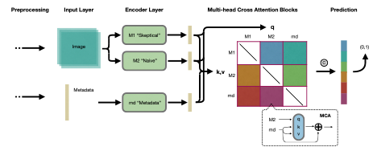

# Multimodel Transformer Framework for Skin Cancer Detection



A novel multimodal approach to skin cancer detection that combines image data and patient metadata from the SLICE-3D dataset, addressing extreme class imbalance through innovative techniques.

## Overview

This repository contains the implementation of a multimodal transformer framework for early skin cancer detection as described in our research paper. Our approach:

- Utilizes both image data and patient metadata from the SLICE-3D dataset
- Addresses extreme class imablance (1:1000) ratio using 3 key strategies:

  - Oversampling malignant tumors
  - Aysmmetric loss function
  - Syntheric data techniques (SMOTE, diffusion models, and GANs)

- Implements an ensemble architecture cobining:

  - CNN models (EfficientNet, ResNet) for image processing
  - Gradient boosting algorithms (XGBoost, LightGBM, CatBoost) for metadata classification
  - Mutual attention blocks for cross-modal feature interaction

Out exeriments have demonstarted promising results.

## Dataset

We use the SLICE-3D dataset, which consists of 401,059 cropped 15mm x 15mm images extracted from 3D Total Body Photos (3D-TBP). Each image has:

- 29 morphological features
- 14 metadata features describing lesion location an patient data
- Only 393 malignant cases (0.098%) among the entire dataset

## Project structure

```plaintext
```

## Installation

```bash
# Clone the repository
git clone https://github.com/petepritch/ICIS-Cancer-Detection.git
cd skincare-ai

# Create a virtual environment
python -m venv env
source env/bin/activate  # On Windows: env\Scripts\activate

# Install dependencies
pip install -r requirements.txt
```

## Authors

- Neil Ash (nfash@umich.edu)
- Pete Pritchard (petep@umich.edu)
- Andrew Jones (drej@umich.edu)
- Zekai Xu (xuzekai@umich.edu)
- Rachel Gu (rachgu@umich.edu)